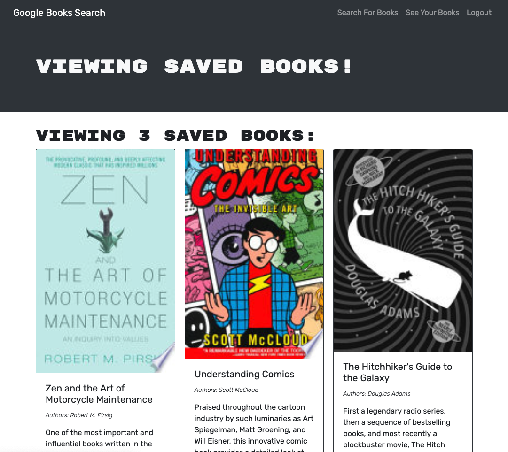

# 📚 personal-library

A React app to search the google books api, and save books to a personal library (powered by React, GraphQL and MongoDB).

View the deployed app at [https://shielded-woodland-33882.herokuapp.com/](https://shielded-woodland-33882.herokuapp.com/)

## Prerequisites

- NodeJS
- MongoDB

## Libraries

- express
- mongoose
- jsonwebtoken
- jwt-decode
- react
- @apollo/client
- apollo-server-express

## Development Setup

- Clone the repo `git clone git@github.com:jmichaelbrown8/personal-library.git`
- Install the dependencies from NPM `npm i`
- Create a `.env` file in the `/server` folder to define a `JWT_SECRET` variable:
  `JWT_SECRET="your_secret_here"`
- Run the develop script `npm run develop`

## Deployment

Deployed to Heroku with MongoDB Atlas using this guide: https://coding-boot-camp.github.io/full-stack/mongodb/deploy-with-heroku-and-mongodb-atlas

